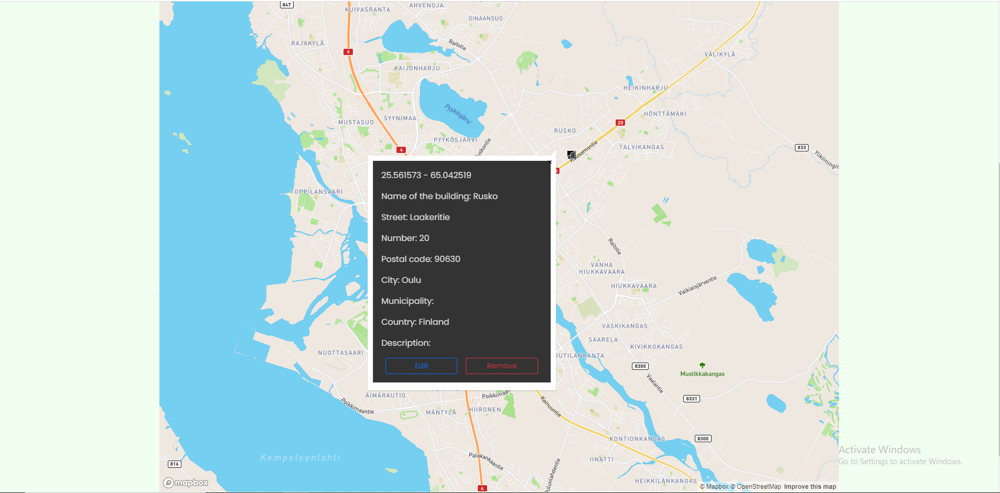

# SkenarioLabs

Frontend assignment: https://affectionate-bassi-1dc9f3.netlify.app/building

## Project Screen



## Setup environment

Github project: https://github.com/dinhtai0401/skenariolabs

### 1. Setup ReactJS App via Create React App

Link: https://create-react-app.dev/docs/getting-started/

### 2. Add SCSS support

```js
npm i --save-dev node-sass
```

### 3. Add react router 

```
npm i --save react-router-dom
```

### 4. Add UI lib

```
npm i --save reactstrap
```

### 5. Add React-Redux React-Toolkit

```
npm install react-redux reduxjs/toolkit
```

### 6. Add Formik

```
npm i formik
```

### 6. Add Yup

```
npm i yup
```


## Organize folders

```
src
|
|__app
|  |__store.js
|
|__ assets
|  |__ images
|
|__ components (shared components)
|
|__ features
  |__ Building
    |__ components
    |  |__ BuildingDetail
    |  |__ BuildingForm
    |  |__ BuidingList
    |
    |__ pages
    |  |__ MainPage
    |  |__ AddEditPage
    |__ buildingSlice.js
    |__ index.js
```

## Organize routing

- Use lazy loading components technique.
- Load by features.

```js
// App.js
const Building = React.lazy(() => import("./features/Building"));

function App() {
  return (
    <div className="bulding-app">
      <Suspense fallback={<div>Loading ...</div>}>
        <BrowserRouter>
          <Header />
          <Switch>
            <Redirect exact from="/" to="/building" />

            <Route path="/building" component={Building} />
            <Route component={NotFound} />
          </Switch>
          <Footer />
        </BrowserRouter>
      </Suspense>
    </div>
  );
}
```

## Custom Field 

- Bridge between UI control and Formik.
- UI control is a controlled component with props:
   - name: the name that identifies the control
   - value: value of control
   - onChange: trigger this function with a new value when there is a change
   - onBlur: determine when this control is touched

```js
function InputField(props) {
  const { field, form, type, label, placeholder, disabled } = props;
  const { name } = field;
  const { errors, touched } = form;
  const showError = errors[name] && touched[name];

  return (
    <div>
      <FormGroup>
        {label && <Label for={name}>{label}</Label>}

        <Input
          id={name}
          {...field}
          type={type}
          disabled={disabled}
          placeholder={placeholder}
          invalid={showError}
        />
      </FormGroup>

      <ErrorMessage
        className="invalid-feedback d-block"
        name={name}
        component={FormFeedback}
      />
    </div>
  );
}
```

## Random Photo control

Coordinate
Props
  - name
  - coordinate 
  - onCoordinateChange 
  - onGetCoordinateButtonBlur

CoordinateField

Formik

Yup

## Usage

- Installing and starting

```
git clone https://github.com/dinhtai0401/skenariolabs.git
npm install - to install all needed packages
npm start  - to run the application
```

- Running tests

```
npm run test
```

## Commits

List of commits can be found in gitLog.txt